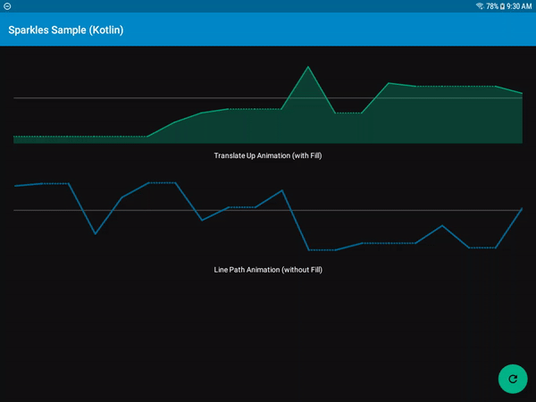
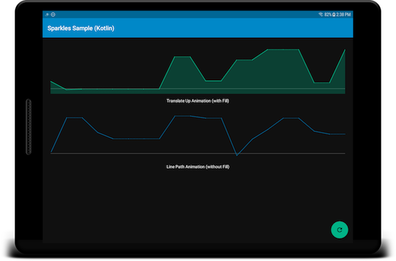
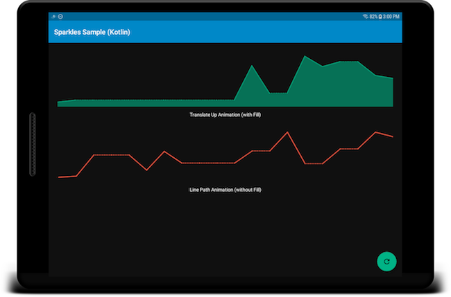

[](https://postmates.com)

[](https://jitpack.io/#postmates/sparkles-android) 


# Sparkles

A custom Graphing library which can leverage missing data points with dotted lines!

## Adding Dependencies


Add this in your root `build.gradle` file (and **not** your module `build.gradle` file):

```gradle
allprojects {
	repositories {
		...
		maven { url "https://jitpack.io" }
		...
	}
}
```

Add this to your app module's `build.gradle` file (make sure the version matches the JitPack badge above):

```gradle
dependencies {
	...
	implementation "com.github.postmates:sparkles-android:${sparklesVersion}"
	...
}
```


## Usage

### 1. Import in your xml layout:

```xml
        <com.postmates.android.sparkles.widget.line.SparklesLineView
            xmlns:sparkles="http://schemas.android.com/apk/res-auto"                                                         
            android:id="@+id/sparkles_line_graph"
            android:layout_width="match_parent"
            android:layout_height="@dimen/graph_height"
            ...  
            <!-- customize it -->                                                       
            sparkles:pm_sparkles_animationType="translate_up"
            sparkles:pm_sparkles_lineColor="@android:color/white"
            sparkles:pm_sparkles_lineWidth="2dp"
            sparkles:pm_sparkles_baseLineColor="@android:color/gray"
            sparkles:pm_sparkles_baseLineWidth="1dp"
            sparkles:pm_sparkles_fillOpacityPercent="50"
            sparkles:pm_sparkles_shouldFill="true" />
```

### 2. In your `Activity`:

Kotlin: 

```kotlin
        sparklesAdapter = SparklesAdapter()
        sparklesAdapter.setInput(..)
        sparklesGraphView.adapter = sparklesAdapter
```

Java: 

```java
        sparklesGraphView = findViewById(R.id.sparkles_line_graph);
        SparklesAdapter adapter = new SparklesAdapter();
        adapter.setInput(..);
        sparklesGraphView.setAdapter(adapter);
```

### 3. Adapter Input: 

- [REQUIRED] List of [`SparklesDataPoint`](https://github.com/postmates/sparkles-android/blob/master/sparkles/src/main/java/com/postmates/android/sparkles/model/SparklesDataPoint.kt) 
- [OPTIONAL] A baseline in the form of [`SparklesDataPoint`](https://github.com/postmates/sparkles-android/blob/master/sparkles/src/main/java/com/postmates/android/sparkles/model/SparklesDataPoint.kt) 

### 4. Dynamic Runtime Changes:

To update your graph input (just call `setInput` on adapter with the new values):

Kotlin: 

``` kotlin
    sparklesAdapter.setInput(..)
```

Java: 

``` kotlin
    sparklesAdapter.setInput(..);
```

To update your graph style:

Kotlin: 

``` kotlin
        sparklesGraphView.apply {
            lineColor = ContextCompat.getColor(context, R.color.primary)
            lineWidth = resources.getDimension(R.dimen.graph_line_width)
            baseLineColor = ContextCompat.getColor(context, R.color.accent)
            baseLineWidth = resources.getDimension(R.dimen.graph_base_line_width)
            animationType = AnimationType.TRANSLATE_UP | AnimationType.LINE_PATH
            fillOpacityPercent = resources.getInteger(R.integer.fill_percent)
            shouldFill = true | false
        }
```

Java: 

``` java
        sparklesGraphView.setLineColor(ContextCompat.getColor(this, R.color.primary));
        sparklesGraphView.setLineWidth(getResources().getDimension(R.dimen.graph_line_width));
        sparklesGraphView.setBaseLineColor(ContextCompat.getColor(this, R.color.accent));
        sparklesGraphView.setBaseLineWidth(getResources().getDimension(R.dimen.graph_base_line_width));
        sparklesGraphView.setAnimationType(AnimationType.TRANSLATE_UP | AnimationType.LINE_PATH);
        sparklesGraphView.setFillOpacityPercent(getResources().getInteger(R.integer.fill_percent));
        sparklesGraphView.setShouldFill(true | false);
```


## GIF



## Screenshots



